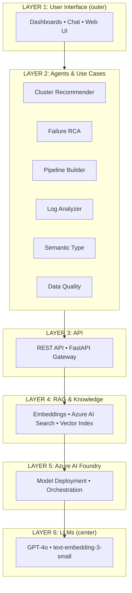
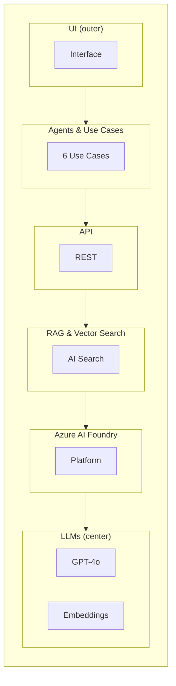

# Architecture Layers Diagram for Presentation

This document defines the recommended circular/concentric layers for the Databricks AI Agents architecture and provides diagrams for presentations.

---

## Recommended Layer Order (Outer → Center)

**Preferred structure:** UI at the edge (user entry point), LLMs at the center (the "brain"). Agents and Use Cases merged into one layer with six smaller circles.

| Layer | Name | Contents | Notes |
|-------|------|----------|-------|
| **1 (Outer)** | User Interface | Dashboards, Chat, Web UI | User entry point |
| **2** | Agents & Use Cases | Six smaller circles: Cluster Recommender, RCA, Pipeline Builder, Log Analyzer, Semantic Type, Data Quality | The intelligence; merged layer |
| **3** | API | REST API, FastAPI gateway | Routing layer |
| **4** | RAG & Knowledge | Embeddings, Azure AI Search, vector index | Enhances agents with context |
| **5** | Azure AI Foundry | Platform, model deployment, orchestration | Where AI runs |
| **6 (Center)** | LLMs & Models | GPT-4o, text-embedding-3-small | The foundation; the "brain" |

**Flow:** User (UI) → selects use case → API routes → Agent executes → RAG enhances → Foundry hosts → LLMs power.

---

## Alternative: Center → Outward (User-Centric)

**Best for "value to user" narrative:** Start with UI at center, expand outward.

| Layer | Name | Contents |
|-------|------|----------|
| **1 (Center)** | User Interface | UI, dashboards, chat |
| **2** | Agents & Use Cases | Six use cases (Cluster, RCA, Pipeline, Log, Semantic, Data Quality) |
| **3** | API | REST, FastAPI |
| **4** | RAG & Knowledge | Embeddings, AI Search |
| **5** | Azure AI Foundry | Platform |
| **6 (Outer)** | LLMs & Models | GPT-4o, text-embedding-3-small |

---

## Visual: Concentric Layers (ASCII)

**Order: Outer = UI → Agents & Use Cases → API → RAG → Foundry → Center = LLMs**

```
    ╭───────────────────────────────────────────────────────────────────────────╮
    │  LAYER 1 (OUTER): UI — Dashboards, Chat, Web UI                           │
    │  ╭─────────────────────────────────────────────────────────────────────╮  │
    │  │  LAYER 2: Agents & Use Cases (6 circles)                             │  │
    │  │  Cluster • RCA • Pipeline • Log • Semantic • Data Quality            │  │
    │  │  ╭───────────────────────────────────────────────────────────────╮   │  │
    │  │  │  LAYER 3: API — REST, FastAPI                                 │   │  │
    │  │  │  ╭─────────────────────────────────────────────────────────╮  │   │  │
    │  │  │  │  LAYER 4: RAG & Knowledge — Embeddings, AI Search       │  │   │  │
    │  │  │  │  ╭───────────────────────────────────────────────────╮  │  │   │  │
    │  │  │  │  │  LAYER 5: Azure AI Foundry — Platform, Deployment │  │  │   │  │
    │  │  │  │  │  ╭─────────────────────────────────────────────╮  │  │  │   │  │
    │  │  │  │  │  │  LAYER 6 (CENTER): LLMs                    │  │  │  │   │  │
    │  │  │  │  │  │  GPT-4o • text-embedding-3-small           │  │  │  │   │  │
    │  │  │  │  │  ╰─────────────────────────────────────────────╯  │  │  │   │  │
    │  │  │  │  ╰───────────────────────────────────────────────────╯  │  │   │  │
    │  │  │  ╰─────────────────────────────────────────────────────────╯  │   │  │
    │  │  ╰───────────────────────────────────────────────────────────────╯   │  │
    │  ╰─────────────────────────────────────────────────────────────────────╯  │
    ╰───────────────────────────────────────────────────────────────────────────╯
```

**Six Use Cases (as smaller circles around Layer 2):**

```
              [Cluster]      [RCA]      [Pipeline]
                   \           |           /
                    \          |          /
            [Data Quality] — Agents & Use Cases — [Log Analyzer]
                    /          |          \
                   /           |           \
              [Semantic Type]  (6 use cases total)
```

---

## Diagram 1: Radial Flow (Mermaid)

Shows the flow from user (top) to foundation (bottom). Use for slide: "How it works."



---

## Diagram 2: Concentric Layers (Text Reference for PowerPoint/Figma)

Use this to create concentric circles in PowerPoint (Insert → SmartArt → Relationship → Basic Radial) or Figma.

**Order: Outer = UI → Agents & Use Cases → API → RAG → Foundry → Center = LLMs**

```
        ╔══════════════════════════════════════════════════════════════╗
        ║  LAYER 1 (OUTER): User Interface                            ║
        ║  Dashboards • Chat • Web UI                                 ║
        ╠══════════════════════════════════════════════════════════════╣
        ║  LAYER 2: Agents & Use Cases (6 smaller circles)             ║
        ║  Cluster • RCA • Pipeline • Log • Semantic • Data Quality    ║
        ╠══════════════════════════════════════════════════════════════╣
        ║  LAYER 3: API                                               ║
        ║  REST API • FastAPI                                         ║
        ╠══════════════════════════════════════════════════════════════╣
        ║  LAYER 4: RAG & Knowledge                                   ║
        ║  Embeddings • Azure AI Search • Vector Indexing              ║
        ╠══════════════════════════════════════════════════════════════╣
        ║  LAYER 5: Azure AI Foundry                                  ║
        ║  Model Inference API • Deployment • Orchestration            ║
        ╠══════════════════════════════════════════════════════════════╣
        ║  LAYER 6 (CENTER): LLMs & Models                            ║
        ║  GPT-4o • text-embedding-3-small                            ║
        ╚══════════════════════════════════════════════════════════════╝
```

---

## Diagram 3: Circular Stack (Mermaid)

Alternative view emphasizing containment. Flow: UI → Agents & Use Cases → API → RAG → Foundry → LLMs.



---

## PowerPoint / Figma Quick Build Guide

### PowerPoint

1. **Insert** → **Shapes** → **Oval** – draw 6 concentric ovals (or use **SmartArt** → **Relationship** → **Basic Radial**).
2. Label from **outer to center**:
   - Outer: **User Interface**
   - Ring 2: **Agents & Use Cases** (add 6 smaller circles: Cluster, RCA, Pipeline, Log, Semantic, Data Quality)
   - Ring 3: **API**
   - Ring 4: **RAG & Knowledge**
   - Ring 5: **Azure AI Foundry**
   - Center: **LLMs** (GPT-4o, text-embedding-3-small)
3. Use gradient or distinct colors per layer.

### Figma / FigJam

1. Create 6 circles, center-aligned, decreasing radius (largest = outer).
2. Outer ring: UI. Layer 2: 6 small circles for use cases around the agents ring.
3. Use **Auto Layout** or manual alignment for labels.
4. Add arrows or connectors between layers if desired.

---

## One-Slide Narrative (For Presenters)

> *"Users interact with our interface at the edge. They select one of six use cases—cluster recommendations, failure analysis, pipeline building, and more. The API routes their request to the right agent. Those agents are enhanced by RAG and vector search over our historical data. Everything runs on Azure AI Foundry, powered at the center by LLMs like GPT-4o and our embeddings model."*

---

*Recommended: **Outer = UI, Center = LLMs** — user entry point at the edge, the "brain" at the core.*
